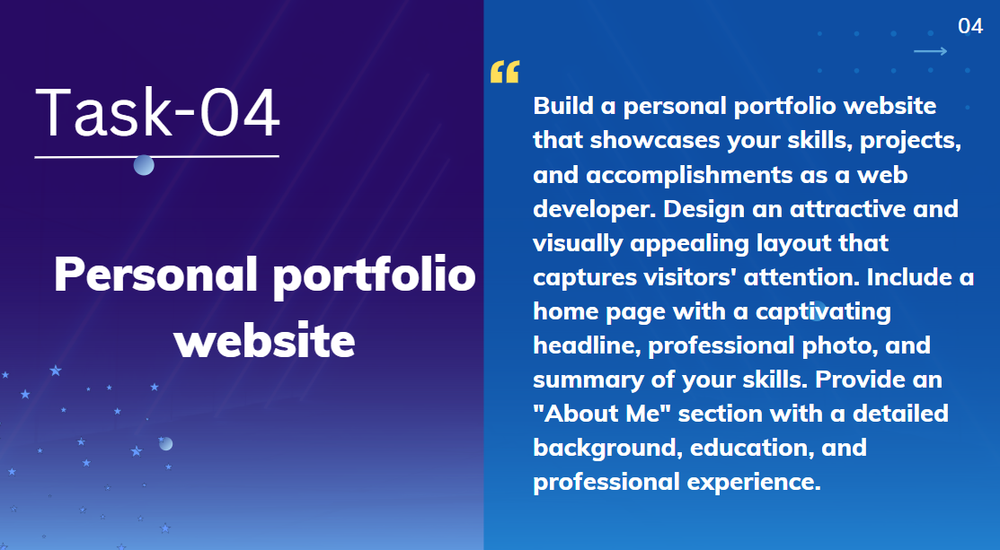

# Task 4: Personal Portfolio Website

🚀 **Internship**: Web Development @ Prodigy InfoTech  
📁 **Task**: Build a personal portfolio to showcase your skills and projects

## 🛠️ Tech Stack:
- HTML
- CSS
- JavaScript

## 💼 Sections Included:
- About Me
- Skills
- Projects with GitHub links
- Contact Form
- Downloadable Resume
  ## 📸 Screenshot

## 🔗 Live Demo:
https://prayoswini.github.io/PRODIGY_WD_04/

## 📂 GitHub Repo:
https://github.com/Prayoswini/PRODIGY_WD_04
